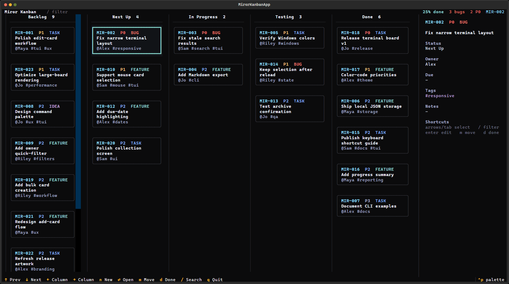

# Miror Kanban

Miror Kanban is a lightweight terminal project board with both a polished interactive TUI and dependency-free command-line workflows.

<p align="center">
  
</p>

## Features

- Five-stage Kanban workflow: Backlog, Next Up, In Progress, Testing, and Done
- Interactive keyboard-and-mouse terminal UI powered by Textual
- Dependency-free CLI commands for automation
- Priorities, item types, tags, owners, notes, and due dates
- Search, filtering, archiving, Markdown export, and progress reports
- Portable JSON storage kept alongside the application

## Requirements

- Python 3.10 or newer
- Textual (only needed for the interactive UI)

## Install and run

```shell
git clone https://github.com/YOUR-ACCOUNT/miror-kanban.git
cd miror-kanban
python -m pip install -r requirements.txt
python miror_kanban.py
```

The interactive UI uses [Textual](https://textual.textualize.io/), which is the only third-party dependency.

The included `miror_kanban.json` starts empty and stores your board locally.

## CLI examples

```shell
python miror_kanban.py board
python miror_kanban.py add --type bug --priority p1 --tag ui,login Fix the login form
python miror_kanban.py move MIR-001 doing
python miror_kanban.py done MIR-001
python miror_kanban.py search login
python miror_kanban.py report
python miror_kanban.py export --output board.md
```

Run `python miror_kanban.py --help` or a subcommand with `--help` for all options.

## License

0BSD — use it freely for any purpose.
